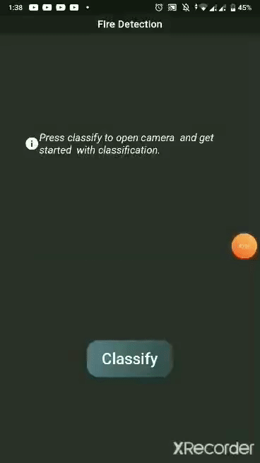

# Fire-Detection

# Introduction

Over the past year, wildfires in Australia captured the attention of the world. In total, more than 17.9 million acres have been burned across Australia's six states -- an area larger than the countries of Belgium and Denmark combined. About half a billion animals have been affected by the fires across NSW, with millions likely dead -- and that's a conservative estimate. That number of total animals affected could be as high as one billion nationwide, according to ecologists from the University of Sydney. Not only in Australia but lot of countries is facing wildfires and bushfires and lot of residents across several coutnries and states lost their homes.

# Solution

A technical solution to this problem can be:
- Heat detection map which is possible by Earth-observing sateliites.
- Use of cameras, drone and remote sensors to estimate the fire's evolution.
- A responsive vision-based wildfire detection system.

# Description

> Here we've built a vision based wildfire detection  which can detect smoke and fire in real-time.

# Implementation

> It is built with Flutter and Tensorflow Lite.

     Tensorflow Lite is basically a compression technique designed to adapt standard tensorflow graph models into lightweight, highly-responsive packages suitable for fast-performance on a light footprint. Such applications include lower-end mobile devices that would be suitable for semi-disposable applications.

> Here the above tensorflow lite package is prepared with [teachable machine](https://teachablemachine.withgoogle.com/train/image).

# Installation 
``` 
flutter packages get
```
# Run
```
flutter run
```
## Sample
<p align="center">
  
</p>

# Reference
1. [medium](https://medium.com/innovation-incubator/real-time-image-classification-on-android-using-flutter-tflite-2674f03caf0f)
2. [code](https://github.com/kr1210/Flutter-Real-Time-Image-Classification)

# Note:
> This is just a sample to detect fire. However, this system is not feasible and efficient in field.
